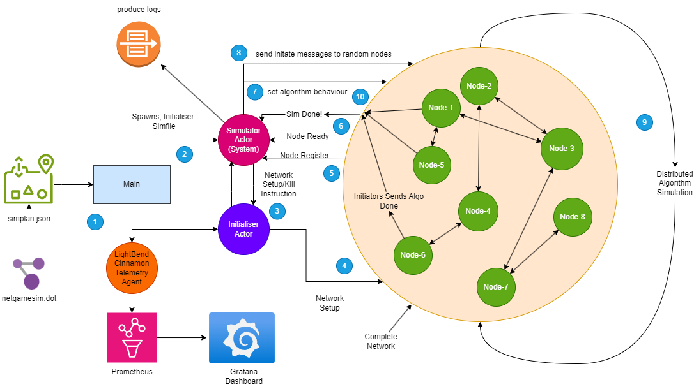
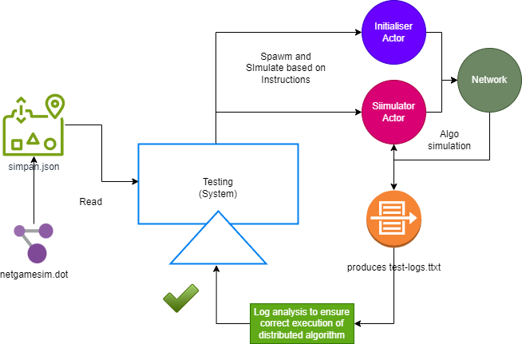
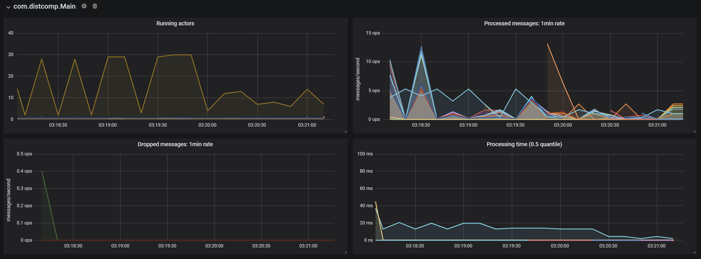

# CS553 Distributed Computing Project => Distributed Algorithms Simulation

This project is a simulation of various distributed computing algorithms implemented in Scala using the Akka framework. We use lightbend telemetry to monitor the performance of the simulation. The project includes the following features:
- Automated simulation of distributed algorithms based on a simulation plan
- Support for message-passing and shared memory algorithms
- Integration with Lightbend Telemetry for monitoring the performance of the simulation
- Visualization of the simulation results using Lightbend Telemetry on Prometheus and Grafana
- Integration tests for the simulation
- Unit tests for the shared memory algorithms

## Simulation Architecture



## Prerequisites

Before you begin, ensure you have met the following requirements:
- You have installed version 17 of [Java](https://www.oracle.com/java/technologies/javase-jdk17-downloads.html), supported version of  [Scala](https://www.scala-lang.org/download/), and [sbt](https://www.scala-sbt.org/download.html).


## Setting Up and Running the Project

1. Clone the repository to your local machine using `git clone`.
2. Navigate to the project directory using `cd <project-directory>`.
3. Create a `lightbend.sbt` file in the project root directory with your Lightbend Telemetry credentials. For more information on obtaining these credentials and setting up Lightbend Telemetry, refer to the [official documentation](https://developer.lightbend.com/docs/telemetry/current/setup/cinnamon-agent-sbt.html).
4. Run `sbt` in the command line to start the sbt shell.
5. Inside the sbt shell, execute `clean compile run <simplan.json>` to clean the project, compile the source code, and run the project with the specified simulation plan.

## Running Tests

This project includes both unit tests and integration tests. To run them, use the following command in the sbt shell:

```bash
sbt clean compile test
```

### Testing Approach



### Mutex Tests

- Test cases for all algorithms (Integration Testing Based on Log Analysis). Directory [`src/test/scala/com/distcomp/mutex`](src/test/scala/com/distcomp/mutex).
- Test cases for Shared Memory Actors (Unit Testing checks for correctness of shared memory) Directory [`src/test/scala/com/distcomp/sharedmemory`](src/test/scala/com/distcomp/sharedmemory).

## Algorithms

### Simulator (Main system actor controlling the simulation)

- Reads simulation plan from a JSON file
- Sends message to initialise the network for simulation
- Waits for nodes to register themself, get ready for simulation
- Changes node behaviour based on simulation plan
- Sends message to start simulation
- Waits for simulation to complete
- ***Weight throwing for termination detection (Slight Variation)***
- Moves to next simulation plan

### [Mutex](./docs/MutexAlgorithms.md)

#### Message Passing based Algorithms

- Ricart Agarwal
- Ricart Agarwal Carvalho Extension
- Raymonds Algorithm
  - Echo Algorithm for Spanning Tree Building 
- Agrawal El Abbadi
  - Strongly Accurate Failure Detector (Based on heartbeats)  

#### Shared Memory (Converted to Message Passing) based Algorithms

- Peterson's Algorithm (Two Process)
  - Uses a custom actor for maintianing shared memory (Petersons Shared Mem Actor)
- Peterson's Algorithm (Tournament for N Processes)
  - Uses a custom actor for maintianing shared memory (Peterson Tournament Shared Mem Actor)
- Bakery Algorithm
  - Uses a custom actor for maintianing shared memory (Bakery Shared Mem Actor)
- Test and Set Lock Algorithm
  - Uses a custom actor for maintianing shared memory (Test and Set Shared Mem Actor)
- Test and Test and Set Lock Algorithm
  - Uses a custom actor for maintianing shared memory (Test and Test and Set Shared Mem Actor)  

> [Simulation Plan](./mutexsimplan.json)


### Telemetry 

The below image shows the telemetry data for the simulation run with the `mutexsimplan.json` simulation plan.



### Election
- Chang Roberts 
- Franklin 
- Dolev Klawe Rodeh
- Tree Election
- Echo Election

> [Election Plan](./electionSimPlan.json)


### Routing
- Chandy-Misra Algorithm with Djikstra-Scholten Termination
- Merlin-Segall Algorithm 
- Touegs Algorithm - Floyd Warshall Algorithm in Distributed Setting
- Frederickson Algorithm

> [Routing Plans](./routingsimplanrun.json)

