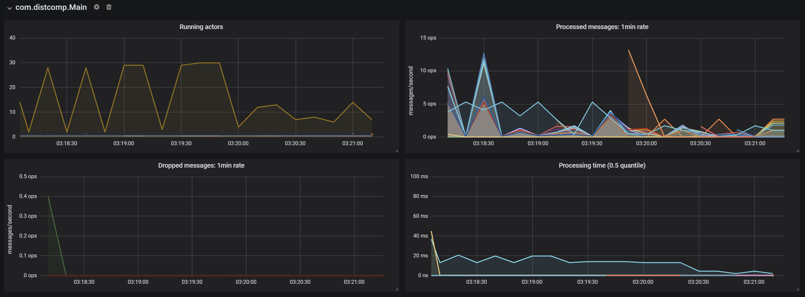

Steps to Run Current stage of Repository:

Install scala, sbt, and java-17
(for telemetry need lightbend credentials in lightbend.sbt)

1. Git Clone
2. Cd to Git Repo
3. create lightbend.sbt with credentials for telemetry
4. write sbt in command line
5. clean compile run <simplan.json>

# Algorithms

## Simulator

- Weight throwing for termination detection (Slight Variation)

## Mutex

### Message Passing

- Ricart Agarwal
- Ricart Agarwal Carvalho Extension
- Raymonds Algorithm
  - Echo Algorithm for Spanning Tree Building 
- Agrawal El Abbadi
  - Strongly Accurate Failure Detector   

### Shared Memory (Converted to Message Passing)

- Peterson's Algorithm (Two Process)
  - Uses a custom actor for maintianing shared memory (Petersons Shared Mem Actor)
- Peterson's Algorithm (Tournament for N Processes)
  - Uses a custom actor for maintianing shared memory (Peterson Tournament Shared Mem Actor)
- Bakery Algorithm
  - Uses a custom actor for maintianing shared memory (Bakery Shared Mem Actor)
- Test and Set Lock Algorithm
  - Uses a custom actor for maintianing shared memory (Test and Set Shared Mem Actor)
- Test and Test and Set Lock Algorithm
  - Uses a custom actor for maintianing shared memory (Test and Test and Set Shared Mem Actor)  

### [Simulation Plan](./mutexsimplan.json)

1. Ricart Agarwal
2. Ricart Agarwal Carvalho Extension
3. Raymonds Algorithm
4. Agrawal El Abbadi
5. Peterson's Algorithm (Tournament for N Processes) 26 Processes
6. Peterson's Algorithm (Tournament for N Processes) 8 Processes
7. Peterson's Algorithm (Two Process)
8. Bakery Algorithm
9. Test and Set Lock Algorithm
10. Test and Test and Set Lock Algorithm

## Telemetry 

### [Mutex](./mutexsimplan.json)

## Testing 

- Test cases for all algorithms (Integration Testing Based on Log Analysis). Directory [`src/test/scala/com/distcomp/mutex`](src/test/scala/com/distcomp/mutex).
- Test cases for Shared Memory Actors (Unit Testing checks for correctness of shared memory) Directory [`src/test/scala/com/distcomp/sharedmemory`](src/test/scala/com/distcomp/sharedmemory).